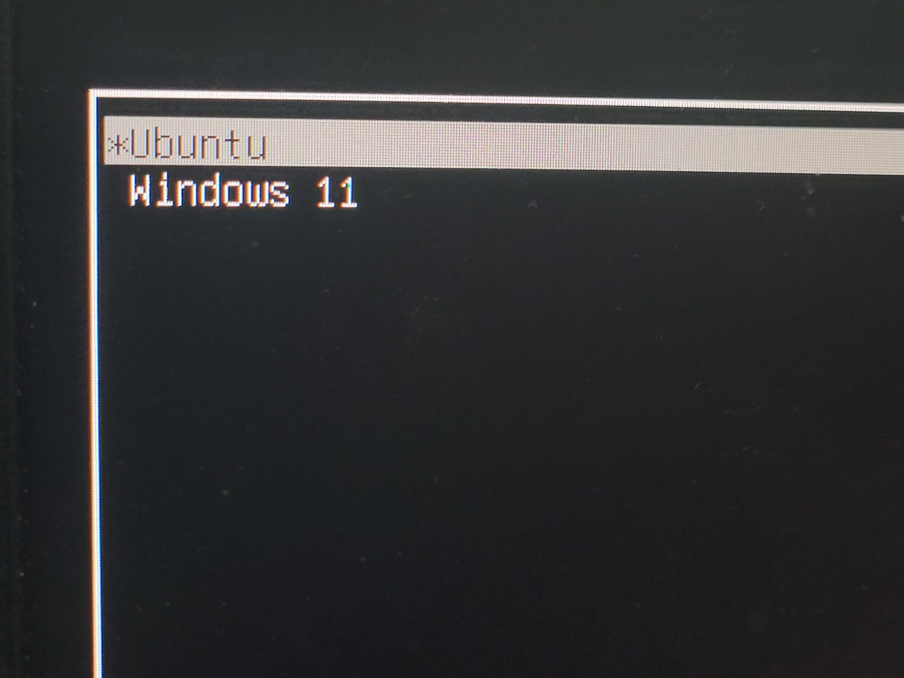
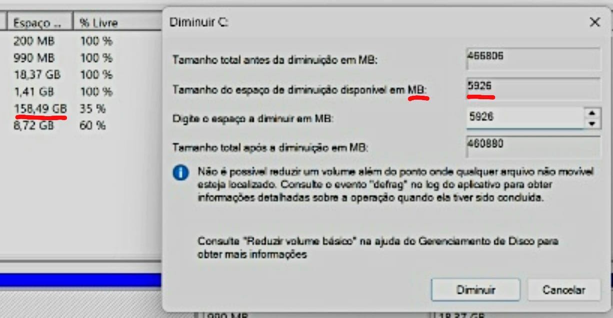
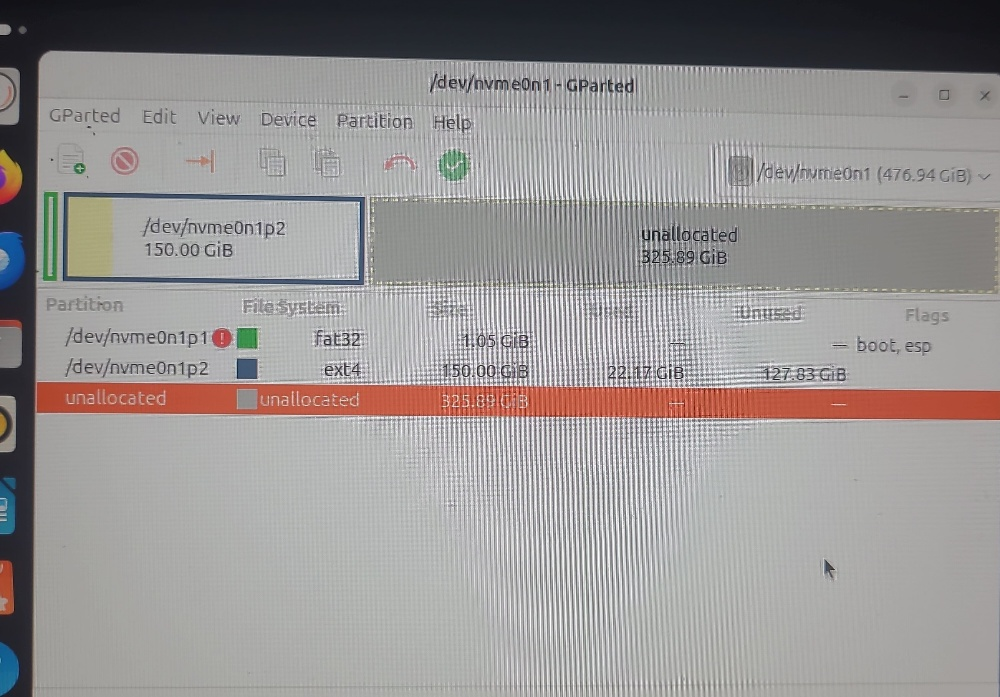
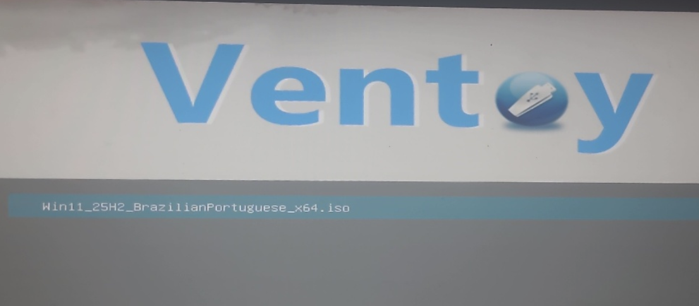
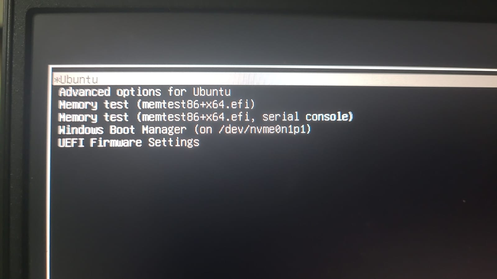
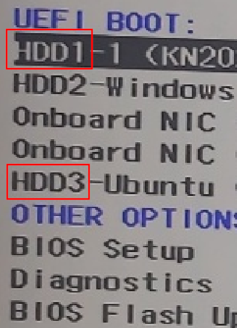
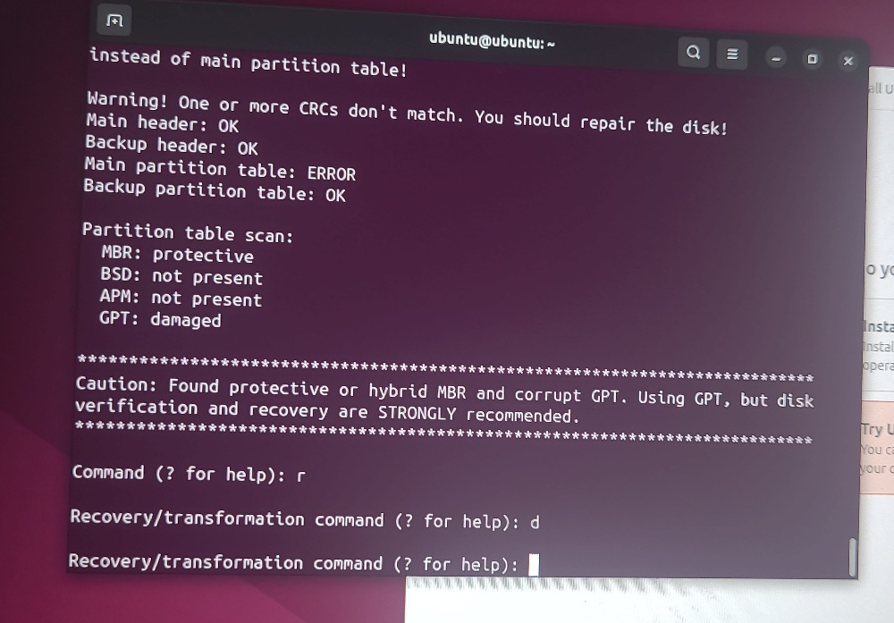
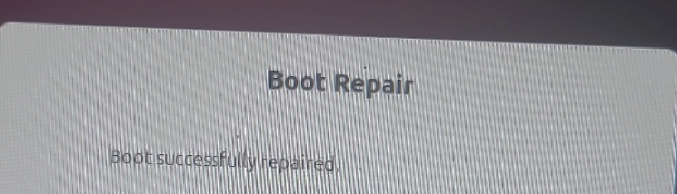

# Linux & Windows dualboot report 

  

**Operating Systems:** Ubuntu 24.04 LTS & Windows 11
**Hardware:** Dell G15 5525

* AMD Ryzen 7 6800H
* NVIDIA RTX 3060
* 512GB NVMe SSD

## 1. Context and Motivation

The need to migrate to a native Linux development environment emerged during a project that adopted **Docker** as the primary tool for environment and service orchestration. Although Docker Desktop on Windows—running on top of WSL2—is a viable solution, it introduces an additional virtualization layer, increases memory usage, and may require a paid license depending on usage.

Linux is Docker’s native and officially recommended environment. This fact, combined with a long-standing interest in learning Linux more deeply, motivated the decision to implement a **dual-boot system**, keeping Windows for personal use while adopting Linux for development purposes.

## 2. Initial System State

The notebook was shipped with **Windows 11**, Dell proprietary software, and Microsoft utilities preinstalled. The internal 512GB NVMe SSD already contained multiple system and recovery partitions.

Prior to this project, storage limitations caused by large game libraries led to the use of an **external 1TB SSD** for games. While functional, this decision influenced later disk management considerations during the dual-boot implementation.

## 3. The First Major Barrier: Windows 11 Disk Shrinking Limitations

The first attempt to create space for Linux involved shrinking the Windows partition using **Windows Disk Management**. Despite having approximately **160GB of free space**, the system only allowed shrinking the partition by **5GB**.

This limitation is caused by the presence of **unmovable system files** located near the end of the partition, including:

* Page file (`pagefile.sys`)
* Hibernation file (`hiberfil.sys`)
* System restore points
* NTFS metadata structures

  

### Mitigation Attempts

Multiple mitigation steps were attempted, both individually and combined, with several system reboots:

* Disabling **BitLocker** disk encryption
* Disabling virtual memory (page file)
* Disabling system protection and restore points
* Removing the hibernation file using `powercfg -h off`

At best, these efforts freed approximately **37GB**, which was still insufficient for a development-focused Linux environment. Based on research and recommendations, a minimum of **100–200GB** was considered necessary.

## 4. Attempts via Ubuntu Installer and GParted (Live Environment)

The next approach was to allow the **Ubuntu installer** to manage partitioning. A bootable USB drive was created using **Rufus**, following official Ubuntu documentation.

However:

* The installer could not resize the Windows partition.
* Using **GParted** from the *Try Ubuntu* (Live USB) environment also failed, as the disk remained locked.

At one point, Windows marked the disk with a **Dirty Bit**, temporarily preventing further operations.

This confirmed that Windows actively protects its disk state, even when accessed externally.

## 5. Strategic Pivot: Clean Installation (Linux First)

At this stage, the strategy changed completely.

The decision was made to:

* Fully wipe the internal SSD
* Install **Ubuntu first**
* Manually define disk allocation for each operating system

Ubuntu was installed with **150GB allocated**, leaving the remaining space unallocated for Windows. This immediately eliminated all prior disk management restrictions.

  

## 6. Key Tool: Ventoy

To reinstall Windows from Linux, **Ventoy** was adopted.

Ventoy proved ideal because:

* It supports **multiple ISO files** on a single USB drive
* No reflashing is required; ISO files are simply copied
* The boot menu is minimal and intuitive

This allowed seamless switching between Ubuntu and Windows installers.

  

## 7. Windows Reinstallation and Debloating

Windows 11 was reinstalled as a **clean installation**, without Dell’s factory image.

Post-installation steps included:

* Skipping Microsoft account login
* Removing or disabling:

  * Copilot
  * OneDrive
  * Xbox Game Bar
  * Dell telemetry and background services
* Manual installation of NVIDIA GPU drivers

The result was a significantly lighter and more controlled Windows environment.

## 8. Boot Management: GRUB and Critical Recovery

Initially, **GRUB (Grand Unified Bootloader)** was successfully configured as the primary bootloader, allowing seamless switching between Ubuntu and Windows 11 without requiring firmware-level interaction.

  

### 8.1. The Failure Scenario

After disk-related operations performed from within Windows, the system’s boot path became corrupted. This was not a simple missing boot entry, but a **low-level disk metadata failure** that rendered the Linux environment effectively invisible to the bootloader.

- **GRUB Rescue:** Upon startup, the system defaulted to a minimal BASH-like prompt. Manual `ls` commands returned `unknown filesystem` for all partitions, confirming that GRUB could no longer map the NVMe SSD structure.
- **UEFI Inconsistency:** Diagnostics performed via Windows (using `bcdedit /enum firmware`) confirmed that the Ubuntu EFI entry still existed in the firmware, but the Dell Boot Manager displayed duplicated entries, indicating broken or inconsistent pointers to the physical drive.

  
  

### 8.2. The High-Level Recovery Process (Live USB Environment)

Since the Ubuntu installation was completely inaccessible and Windows lacks native tools to repair Linux partitions or the GRUB bootloader, **the recovery was performed exclusively via an Ubuntu Live USB (Try Ubuntu mode)**. This labor-intensive process involved the following sequence:

1. **GPT Partition Table Repair:** Using the Live USB terminal, diagnostics revealed a corrupted GPT with a CRC mismatch. This was the most critical step: the primary partition table had to be restored using the backup header to recover the disk’s structural integrity.
2. **Partition Identification:** Only after the GPT recovery did the command `lsblk` successfully identify the **150GB Ubuntu partition (`nvme0n1p2`)**, which had previously been invisible to the system.
3. **Environment Preparation:** Because advanced recovery tools are not included by default in the Live ISO, network access was established to manually inject the `yannubuntu/boot-repair` PPA and install the necessary utilities.
4. **Boot-Repair & Final Sync:** The Boot-Repair utility was executed to reinstall GRUB and re-link the EFI pointers between the restored partitions and the UEFI firmware. The process concluded with `sudo update-grub`, fully restoring the stable dual-boot menu.

  
  
   

## 9. Final System Architecture

- **Internal NVMe SSD (512GB)**
  - **Ubuntu:** Development environment, Docker, academic activities
  - **Windows 11:** Personal and general-purpose use

The partition layout is structured to ensure performance, stability, and long-term maintainability. Boot management is centralized through GRUB, providing controlled and predictable OS selection at startup.

## 10. Post-Recovery Optimization & Polish

After restoring full functionality, the focus shifted toward environment stabilization and aesthetic refinement:

  * **Time Sync:** Executed `timedatectl set-local-rtc 1` to resolve the hardware clock conflict between Windows and Linux.
  * **GRUB Polish:** The boot menu was refined and organized by removing duplicate or "ghost" entries and optimizing the timeout for a faster startup workflow.
  * **Maintenance:** Used `sudo update-grub` as the final step to validate kernel updates and ensure the new partition layout was correctly mapped.
  * **Ultimate Recovery Toolkit:** The Ventoy USB drive was configured as a multi-boot device containing both Windows 11 and Ubuntu ISOs, ensuring immediate recovery and deployment capability when needed.

## 11. Lessons Learned

* Windows 11 imposes strict limitations on disk resizing due to unmovable system files.
* Installing Linux **before** Windows offers far greater control over disk layout.
* Live environments are essential for recovery and troubleshooting.
* GRUB, the default Ubuntu bootloader, proved to be a solid choice due to its native integration and seamless update handling.
* Ventoy proved to be a highly flexible and efficient multi-ISO solution, simplifying testing, recovery, and system experimentation.

## 12. Conclusion and Next Steps

The dual-boot environment is now stable, optimized, and visually clean. This process proved that while the learning curve for Linux system administration can be steep, the resulting control over the hardware and development environment is well worth the effort.

Next Steps: With a solid foundation in place, future goals include exploring different distributions—such as Fedora and Arch Linux—to further understand diverse package management systems and system architectures.
